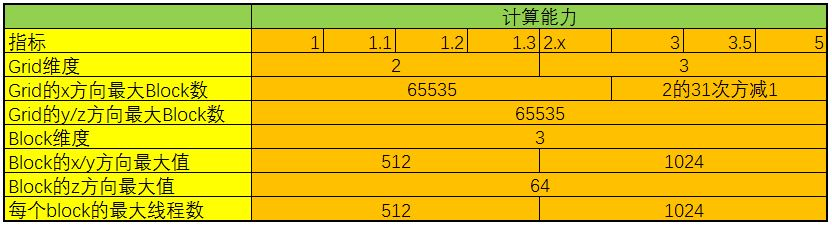

### 2.3.4
CUDA中堆能够定义的网格大小和线程块大小做了限制。（开普勒架构后），网格大小在x，y，z这三个方向的最大允许值分别为2^31-1，65535和65535；线程块大小在x，y，z这三个方向的最大允许值分别为1024,1024和64。另外，还要求线程快总的大小，即blockDim.x，blockDim.y和blockDim.z的乘积不能大于1024。也就是说不论怎么定义一个线程块最多只能有1024个线程。
